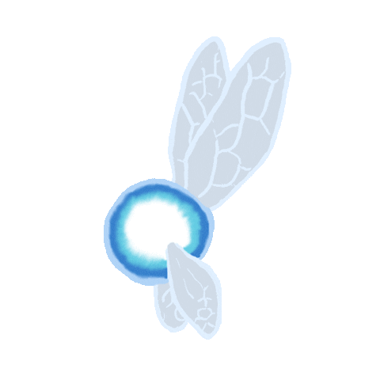

### Hey! Listen!
🚧 This README is under construction 🚧
#

### My name is Eduardo 
### I'm a software engineering student and a technology enthusiast. ✨
#

### Technlogies 💻      

   
#
### Contacts 📫

   

 

<a href="https://github.com/eduabdala">

                  
          

<!--
**eduabdala/eduabdala** is a ✨ _special_ ✨ repository because its `README.md` (this file) appears on your GitHub profile.

Here are some ideas to get you started:

- 🔭 I’m currently working on ...
- 🌱 I’m currently learning ...
- 👯 I’m looking to collaborate on ...
- 🤔 I’m looking for help with ...
- 💬 Ask me about ...
- 📫 How to reach me: ...
- 😄 Pronouns: ...
- ⚡ Fun fact: ...
-->
