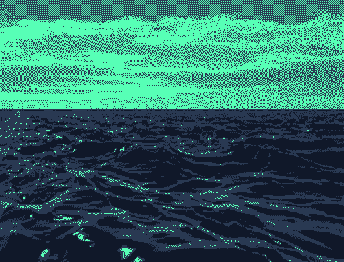

### Hey! Listen!

#### Me chamo Eduardo
#### Sou estudante de engenharia de software, curto jogos e desenhar as vezes. 

- 🔭 I’m currently working.
- 🌱 I’m currently learning python.
- 👯 I’m looking to collaborate on open-source projects
- 🤔 I’m looking for help with english conversation
- 💬 Ask me about anything
- 😄 Pronouns: he/him
- ⚡ Fun fact: i love whiskey sour.
#

#### Technlogies 💻      
          

####

          
          

          
          
          
          

#

 

<a href="https://github.com/eduabdala">

                  
          

<!--
**eduabdala/eduabdala** is a ✨ _special_ ✨ repository because its `README.md` (this file) appears on your GitHub profile.

Here are some ideas to get you started:

- 🔭 I’m currently working on ...
- 🌱 I’m currently learning ...
- 👯 I’m looking to collaborate on ...
- 🤔 I’m looking for help with ...
- 💬 Ask me about ...
- 📫 How to reach me: ...
- 😄 Pronouns: ...
- ⚡ Fun fact: ...
-->
